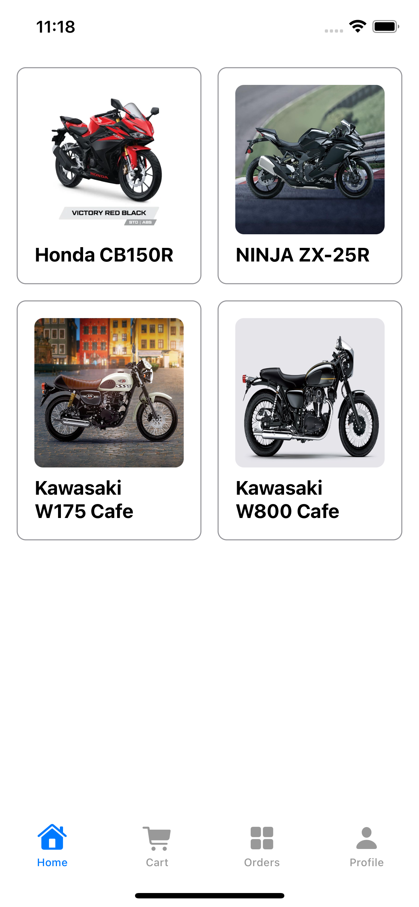

# Showroom

a Motorcycle mobile app. This app builded using XCode Version 14.0 (14A309).

This project is Nawatech IOS Developer Coding Test.

Name : Nanda Nur Septama
Email : nandanurseptama@gmail.com
Github : https://github.com/nandanurseptama

# Information

There are several folder in this repository

- assets (assets folder is folder that located)
- assets/jsons (product data json)
- assets/images (product image assets)
- readme_assets (assets for readme)
- Showroom (IOS Project folder)

For showing products at home/product detail, it will get jsons file that hosted in my github repository.

- <a href="https://github.com/nandanurseptama/Showroom_Projects/blob/master/assets/jsons/fetch_all_products.json?raw=true">Fetch All Product JSON</a>
- <a href="https://github.com/nandanurseptama/Showroom_Projects/blob/master/assets/jsons/product_1.json?raw=true">Single Product Example JSON</a>

This project used MV pattern, inspired by <a href="https://azamsharp.com/2022/10/06/practical-mv-pattern-crud.html">this article</a>, since i usually used Flutter and rarely used SwiftUI for building Mobile App (Android or IOS), so i need to adapt the Swift syntax. This is first time i build IOS app with Swift. Usually i used swift for implementing method channel or event stream in Flutter.

Why i choose MV pattern ? because its simple, no need large boiler plate like (MVVM, SOLID or VIPER). I dont dislike those pattern. But this MV pattern brings me new insight. Thanks for this assignment, cause for this task i do some reseearch and found MV pattern article. 

# Showroom Project structure

- Showroom (main folder)
  | - Build (build cache folder)
  | - Showroom (folder that located swift, plist and etc at main source code)

  | ---- Extensions (Extensions folder for class/struct)
  | ---- Models (Models class that interact with user event & Data class/struct)
  | -------- Data (Encodable data class/struct)

  | ---- UI (Screen and Component View)

  | - ShowroomTests (folder that located unit test )
  | - ShowroomUITests (folder that located UI/E2E test)

There are lots of things that can be improved from this source code, for example separating function/event handling in the model class by creating an extension to that model class.

# Running Project

- Open 'Showroom' folder with XCode and run.

## Screenshoots

</img>
</img>
</img>
</img>
</img>
</img>
</img>